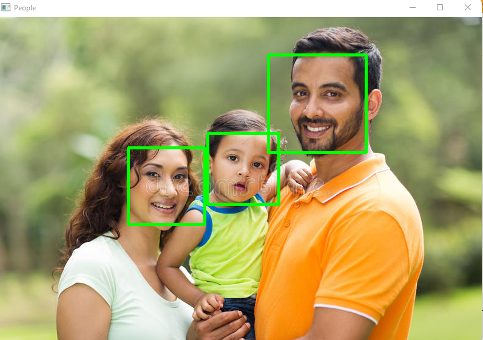
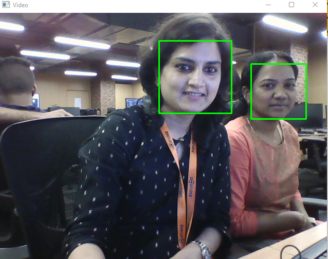

<h1 align="center">Python Face Detection App </h1>

Application url : [URL_Shortner](https://ineuronurl.herokuapp.com/)

<h5> This Application will detect object of interest (human face) in real time. Application will detect face either from user uploaded image or frames from web camera. </h5>

##   <b>Approach</b>

- Use Opencv
- Run web server with Flask

##  <b> API</b>

1. Project Flowchart


2. Landing page of application


3. option to upload image


4. Display uploaded image in frame


5. Display face detected of uploaded image



6. Display face detected using webcam



 ## 💻 How to setup:


Creating conda environment
```
conda create -p venv python==3.8 -y
```

activate conda environment
```
conda activate ./env
```

Install requirements
```
pip install -r requirements.txt
```
Run the live server using flask
```
python app.py
```
To launch flask ui
```
http://localhost:5000/
```

 ## <b> Technologies Used</b>


 <p align="center">

 1. Opencv
 2. Flask

 ## 🏭 Industrial Use-cases 

- Recognizing Drivers in Cars
- Attendance System
- Identifying accounts on social media
 
 ## 👋 Conclusion

  We have shown the way to implement face detection using image upload and webcam. 